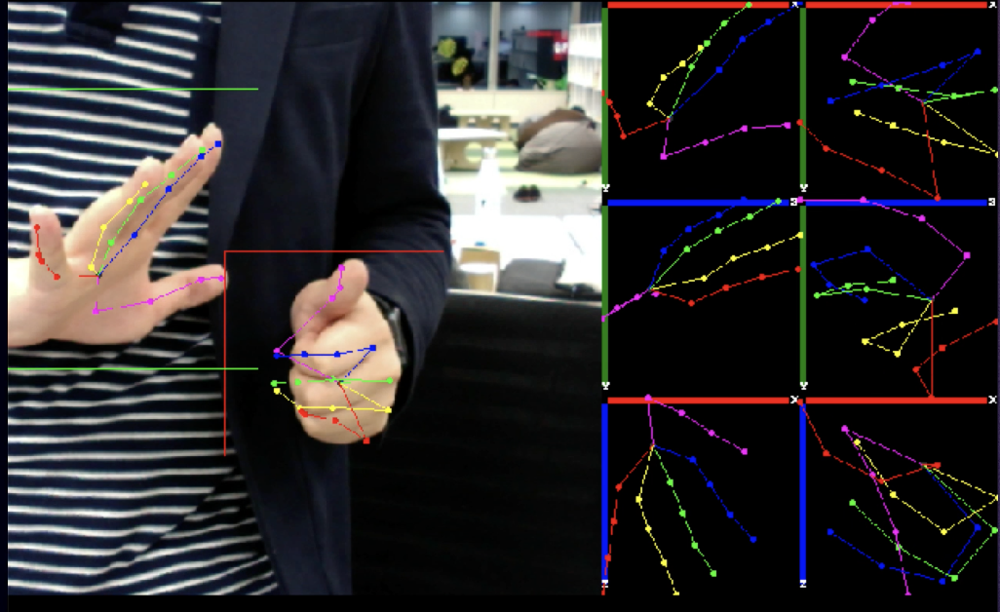

# chainer-hand-pose

- An Chainer [[12]](#Chainer) implementation of 3D hand pose estimation.




- Our algorithm adopts the top-down pipeline that consists of `Detector` and `PoseEstimator` namely:
  - Detector: MobileNetV2 [[9]](#MV2) base SSD (insize=224x224) [[4]](#SSD).
    -  Portions of the code are borrowed from [ChainerCV project](https://github.com/chainer/chainercv) [[8]](#ChainerCV).
  - Pose Estimator: MobileNetV2 base Pose Proposal Networks (insize=224x224) [[10]](#PPN).

- First, `Detector` is applied on the image to
generate a set of bounding-boxes surround human hand. The input image is cropped by them and these cropped patches serve as input to  `PoseEstimator`. It estimates the 2D joint location [[10]](#PPN) and 3D joint vector like [[5]](#OriNet), [[7]](#GANerated) for each hand.


# Directory structure

```
$ cd path/to/this/README.md
$ tree -L 2 -d
.
├── docs
│   └── imgs
├── experiments
│   ├── docker
│   ├── notebooks
│   └── test_images
├── result
│   └── release
└── src
    ├── demo
    ├── detector
    └── pose
```

# How to use

## Setup environment

### Clone this repository

```
$ cd /path/to/your/working/directory
$ git clone git@github.com:Idein/chainer-hand-pose.git
```

### Prepare Docker & NVIDIA Container Toolkit
- For simplicity, we will use docker image of [idein/chainer](https://hub.docker.com/r/idein/chainer/) which includes Chainer, ChainerCV and other utilities with CUDA driver. This will save time setting development environment.


## Prepare dataset

- Prior to training, let's download dataset.
- We provide various scripts that load hand dataest [[1]](#Cascaded), [[2]](#FHAD), [[3]](#Multiview), [[6]](#Synth), [[7]](#GANerated),[[11]](#HandDB), [[13]](#NYU), [[14]](#STB), [[15]](#RHD), [[16]](#Frei) . Before training, you need download
dataset by yourself. See [docs/dataset_preparation.md](docs/dataset_preparation.md) to prepare dataset on your computer for our purpose.


## Train/Predict Detector

- See [docs/detector.md](docs/detector.md)

## Train/Predict PoseEstimator

- See [docs/pose.md](docs/pose.md)

## Run demo (naive implementation)

- After training Detector and PoseEstimator, these results will be stored in `result` directory. We provide demo script to run inference with them.
- You can also use our pre-trained model. See [our release page](https://github.com/Idein/chainer-hand-pose/releases/tag/model).


### Run without docker

- Just run

```
$ cd src
$ python3 demo.py ../result/release ../result/release
```

### Run with docker

- You can also use docker(on Ubuntu machine with GPU).

build docker image from `Dockerfile`
```
$ cd path/to/root/of/repository
$ docker build -t hand_demo experiments/docker/demo/gpu/
```

After finished building the docker image, just run `src/run_demo.sh`

```
$ cd src
$ bash run_demo.sh
```

# Appendix

## Run demo using Actcast framework (a.k.a `actfw`)

See [src/demo/README.md](src/demo)

# References

- <a id="Cascaded">[1]</a> Dollár, Piotr et al. “Cascaded pose regression.” CVPR (2010).
- <a id="FHAD">[2]</a> Garcia-Hernando, Guillermo et al. “First-Person Hand Action Benchmark with RGB-D Videos and 3D Hand Pose Annotations.” CVPR (2017).
- <a id="Multiview">[3]</a> Gomez-Donoso, Francisco et al. “Large-scale Multiview 3D Hand Pose Dataset.” Image Vision Comput. (2017).
- <a id="SSD">[4]</a> Liu, Wei et al. “SSD: Single Shot MultiBox Detector.” ECCV (2016).
- <a id="OriNet">[5]</a> Luo, Chenxu et al. “OriNet: A Fully Convolutional Network for 3D Human Pose Estimation.” BMVC (2018).
- <a id="Synth">[6]</a> Mueller, Franziska et al. “Real-Time Hand Tracking under Occlusion from an Egocentric RGB-D Sensor.” ICCV (2017).
- <a id="GANerated">[7]</a> Mueller, Franziska et al. “GANerated Hands for Real-Time 3D Hand Tracking from Monocular RGB.” CVPR (2017).
- <a id="ChainerCV">[8]</a> Niitani, Yusuke et al. “ChainerCV: a Library for Deep Learning in Computer Vision.” ACM Multimedia (2017).
- <a id="MV2">[9]</a> Sandler, Mark et al. “MobileNetV2: Inverted Residuals and Linear Bottlenecks.” CVPR (2018)
- <a id="PPN">[10]</a> Sekii, Taiki. “Pose Proposal Networks.” ECCV (2018).
- <a id="HandDB">[11]</a> Simon, Tomas et al. “Hand Keypoint Detection in Single Images Using Multiview Bootstrapping.” CVPR (2017).
- <a id="Chainer">[12]</a> Tokui, Seiya, et al. "Chainer: a next-generation open source framework for deep learning." NIPS (2015).
- <a id="NYU">[13]</a> Tompson, Jonathan et al. “Real-Time Continuous Pose Recovery of Human Hands Using Convolutional Networks.” ACM Trans. Graph. 33 (2014).
- <a id="STB">[14]</a> Zhang, Jiawei et al. “3D Hand Pose Tracking and Estimation Using Stereo Matching.” ArXiv (2016).
- <a id="RHD">[15]</a> Zimmermann, Christian and Thomas Brox. “Learning to Estimate 3D Hand Pose from Single RGB Images.” ICCV (2017).
- <a id="Frei">[16]</a> Zimmermann, Christian et al. “FreiHAND: A Dataset for Markerless Capture of Hand Pose and Shape from Single RGB Images.” ArXiv (2019).

